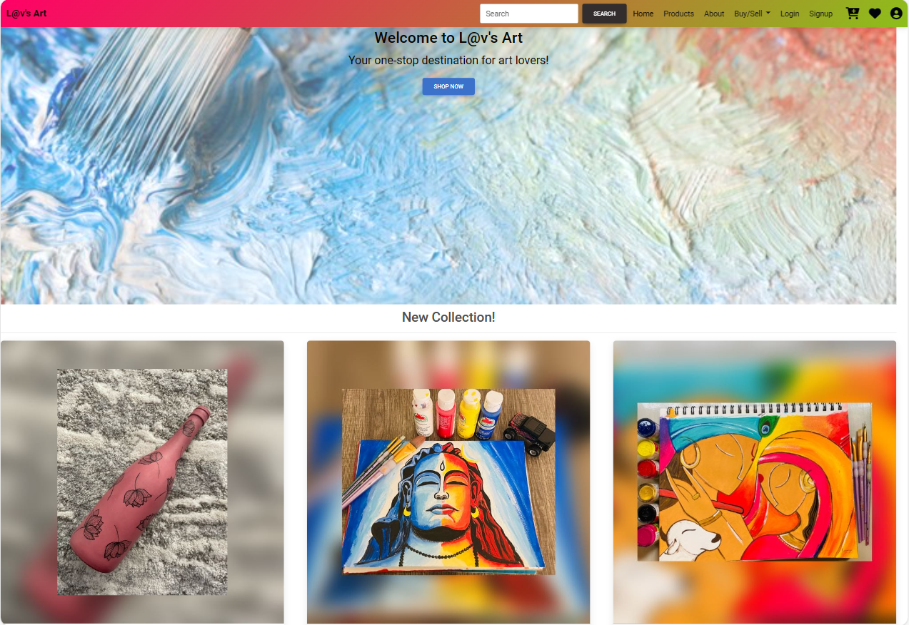
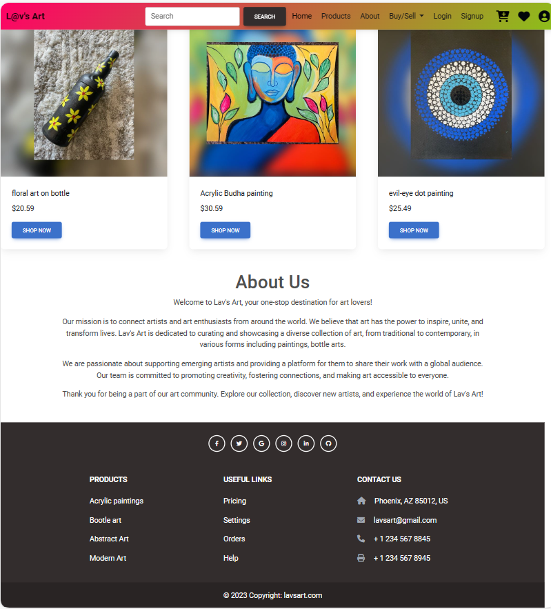
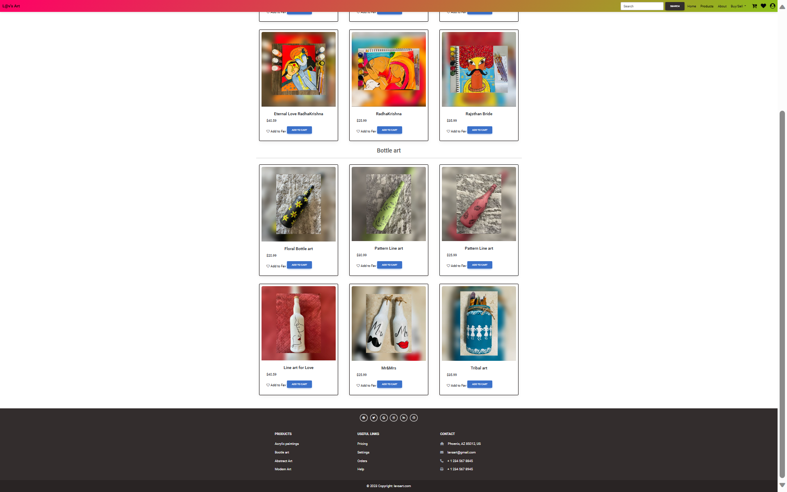
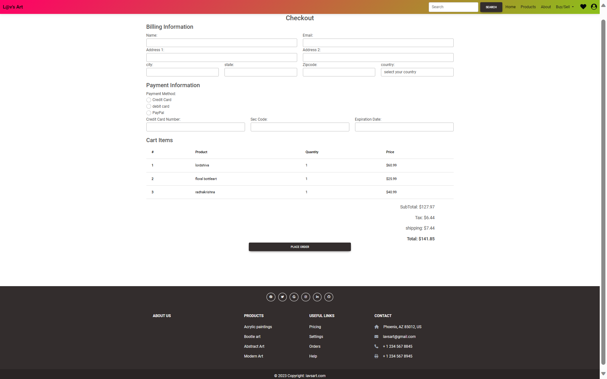

# Lav's Art Website
In this website one can buy the different hand made arts and they can sell their art.
* If the new users don't know much about the website, they an get an idea from the home page.
* If the user don't have an account they can create account buy using Registration/Signup page
* If the user have already an account they can login to the website using login form.
* User can shop the art from products page and they can add to cart or favourite items.
* when the user are ready to place an order they can use checkout page fill the details and they can place an order and can view the cart items.

some of the page designs of my website are:

## Login Page

## Registration page

## Home page

## Products Page

## checkout page
